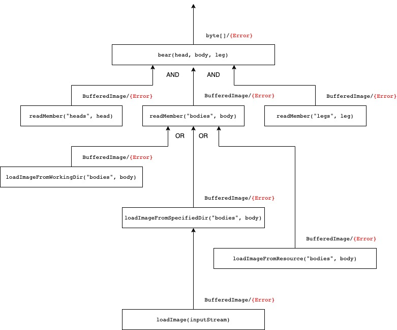

# Bear: error handling experiments

This is a small webserver that serves an image of a **bear** built from three different **member**s:
* head
* body
* leg

Each *member* can be loaded from three different resources:
* working directory of java process
* a configured directory
* java resource packaged into running jar

Search order is respective to the list above.

The flow of data / error is illustrated in the following image:



## Run

```shell
./gradlew bootRun
```
This configures `specified-directory`, and uses `working-directory` as JVM working dir.

## Error handling solutions

### Using special value, `null`

Class: `BearWithNull`
Endpoint: `/bear-with-null/{head}/{body}/{leg}`

Errors are signaled as `null` value, and handled as `null` check in this solution.
`null` value is handled also well by SpringBoot as a return value of the controller method.

The possibility of `null` values doesn't appear in the signature of methods.

### Using null object

Class: `BearWithNullObject`
Endpoint: `/bear-with-null-object/{head}/{body}/{leg}`

If a member of the bear not found, then a "good" default value is returned, which can be handled just the same as any other bear member.

### Using `Optional`

Class: `BearWithOptional`
Endpoint: `/bear-with-optional/{head}/{body}/{leg}`

Errors are signaled as empty `Optional`s, and handled using its API in this solution.
`Optional` return value of controller methods is not handled by SpringBoot,
but it's possible to create `ResponseEntity` corresponding to the result.

### Using custom `Either` type

Class `BearWithEither`
Endpoint: `/bear-with-either/{head}/{body}/{leg}`

Errors are signaled as `Either` with some message included as an alternative.
A `ResponseEntity` is created as a result, based on the value of `Either`.

At each step in the flow, error is propagated with some additional message.
This is not possible using null object, `null` or `Optional`, since they're not able to hold that information.

This solution class contains an alternative, concatenating one, that has some similarities with the solution with null object.

### Using exception

Class: `BearWithException`
Endpoint: `/bear-with-exception/{head}/{body}/{leg}`

Exceptions are propagated as they are - as `NoSuchFileException`s.
All of them are handled by SpringBoot,
except that the image loading business logic in `readMember` uses them to load image from where it is possible.

### Using custom exception

Class: `BearWithCustomException`
Endpoint: `/bear-with-custom-exception/{head}/{body}/{leg}`

A custom exception, `NoSuchBearException` is propagated.
Handled specially by SpringBoot,
except that the image loading business logic in `readMember` uses them to load image from where it is possible.

At each step in the flow, error is propagated with some additional message.
This is also possible using `NoSuchFileException`.

Since this custom exception is a `RuntimeException`, it does not appear in the signature of methods.

## Some resources

https://www.youtube.com/watch?v=fYo3LN9Vf_M
https://fsharpforfunandprofit.com/rop/#monads
https://fsharpforfunandprofit.com/posts/recipe-part2/
https://blog.ploeh.dk/2019/01/14/an-either-functor/
https://blog.ploeh.dk/2019/01/07/either-bifunctor/
https://blog.ploeh.dk/2022/05/09/an-either-monad/
https://blog.ploeh.dk/2018/06/11/church-encoded-either
https://blog.ploeh.dk/2019/06/03/either-catamorphism
