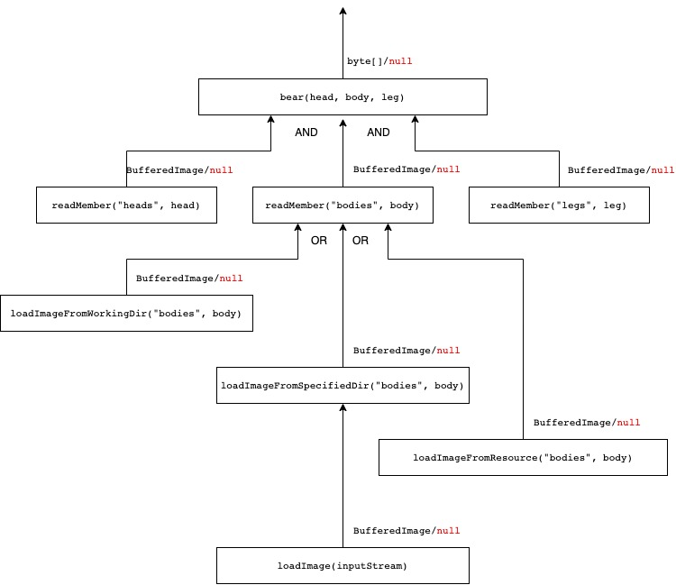
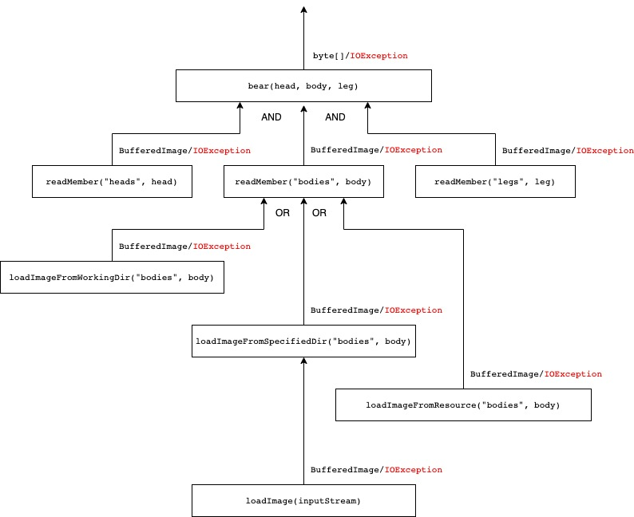

# Bear: error handling experiments

This is a small webserver that serves an image of a **bear** built from three different **member**s:
* head
* body
* leg

Each *member* can be loaded from three different resources:
* working directory of java process
* a configured directory
* java resource packaged into running jar

Search order is respective to the list above.

## Run

```shell
./gradlew bootRun
```
This configures `specified-directory`, and uses `working-directory` as JVM working dir.

### Using special value `null` for error handling

Class: `BearWithNull`
Endpoint: `/bear-with-null/{head}/{body}/{leg}`

Errors are signaled as `null` value, and handled as `null` check in this solution.
`null` value is handled also well by SpringBoot as a return value of the controller method.

The flow of data is illustrated in the following image.



The possibility of `null` values doesn't appear in the signature of methods.

### Using exceptions

Class: `BearWithIOException`
Endpoint: `/bear-with-io-exception/{head}/{body}/{leg}`

Exceptions are propagated as they are - as `IOException`s.
All of them are handled by SpringBoot,
except that the image loading business logic in `readMember` uses them to load image from where it is possible.



Class: `BearWithException`
Endpoint: `/bear-with-exception/{head}/{body}/{leg}`

A custom exception, `NoSuchBearException` is propagated.
Handled specially by SpringBoot,
except that the image loading business logic in `readMember` uses them to load image from where it is possible.

The diagram is almost the same as the `IOException` case.
Since this custom exception is a `RuntimeException`, it does not appear in the signature of methods.
